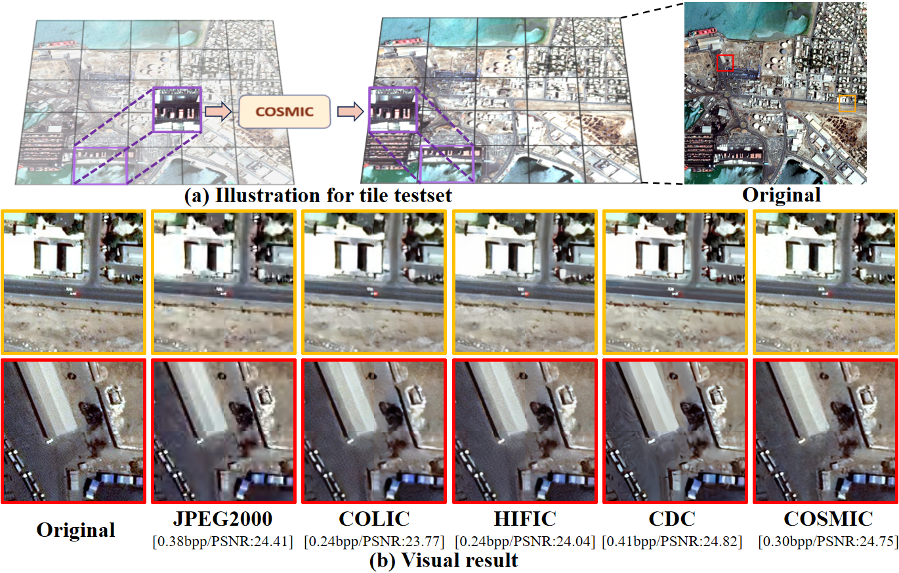

# COSMIC: Compress Satellite Images Efficiently via Diffusion Compensation

Official implementation of  COSMIC: Compress Satellite Images Efficiently via Diffusion Compensation

All Code and pretrained models will be released soon… 👩🏻‍💻 🛰️ 🚀

Abstract: With the rapidly increasing number of satellites in space and their enhanced capabilities, the amount of earth observation images collected by satellites is exceeding the transmission limits of satellite-to-ground links. Although existing learned image compression solutions achieve remarkable performance by using a sophisticated encoder to extract fruitful features as compression and using a decoder to reconstruct. It is still hard to directly deploy those complex encoders on current satellites' embedded GPUs with limited computing capability and power supply to compress images in orbit. In this paper, we propose COSMIC, a simple yet effective learned compression solution to transmit satellite images. We first design a lightweight encoder (i.e. reducing FLOPs by 2.6 ~ 5x ) on satellite to achieve a high image compression ratio to save satellite-to-ground links. Then, for reconstructions on the ground, to deal with the feature extraction ability degradation due to simplifying encoders, we propose a diffusion-based model to compensate image details when decoding. Our insight is that *satellite's earth observation photos are not just images but indeed multi-modal data with a nature of Text-to-Image pairing* since they are collected with rich sensor data (e.g. coordinates, timestamp, etc.) that can be used as the condition for diffusion generation. Extensive experiments show that COSMIC outperforms state-of-the-art baselines on both perceptual and distortion metrics.

